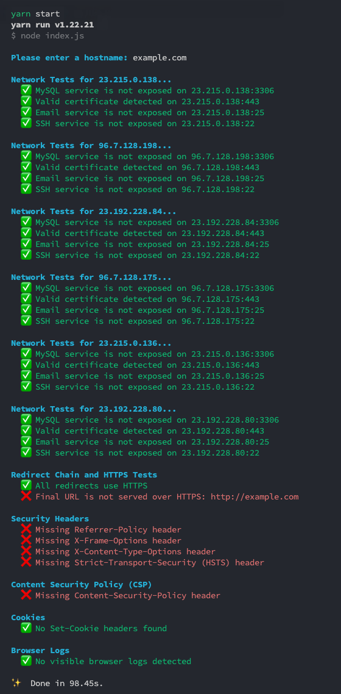

# Security Sentinel
This tool scans a website to uncover common network and web application security weaknesses. It analyzes critical areas like security headers, cookie configurations, and SSL/TLS settings, providing insights for improving a site's security.

## Install
```bash
yarn install
```

## Usage
```bash
yarn start
```


